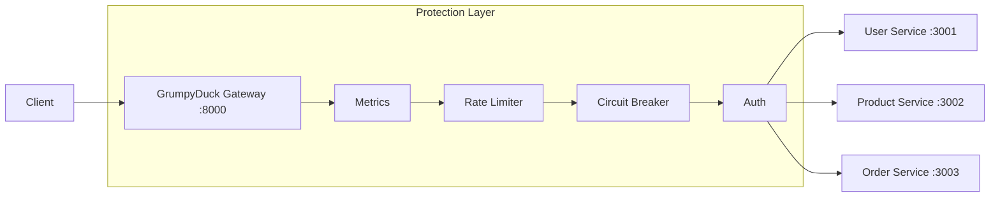

# 🦆 GrumpyDuck API Gateway

[](https://nodejs.org/)
[](https://www.docker.com/)
[](https://opensource.org/licenses/MIT)
[](https://prometheus.io/)

> **GrumpyDuck** is a production-ready, resilience-first API Gateway built for Node.js microservices. It doesn't just route traffic—it protects your services from cascading failures, floods, and unauthorized access.

---

## 🚀 Why GrumpyDuck?

Most gateways are built for operators. GrumpyDuck is built for **developers**.

- **Resilience Over Everything:** Includes circuit breakers (Opossum), rate limiters (Redis), and timeouts out of the box.
- **Node-Native:** No complex DSL or Lua scripts. It's just Express. If you know JS, you can customize the gateway in minutes.
- **Battle-Ready Observability:** Built-in Prometheus metrics and Pino structured logging with correlation IDs.
- **Plug-and-Play:** Drop it into any architecture by editing a single JSON file.

---

## 🛠 Features

- 🛡️ **Circuit Breaker:** Prevents cascading failures using the Circuit Breaker pattern.
- 🚦 **Rate Limiting:** Distributed rate limiting powered by Redis.
- 🔑 **JWT Authentication:** Secure routing with granular public/private path control.
- 📉 **Observability:** Real-time metrics dashboard via Prometheus & Grafana.
- 🪵 **Structured Logging:** JSON logs with correlation IDs for easy tracing.
- 🏗️ **Dockerized Stack:** Spin up the gateway, Redis, and mock services with one command.

---

## 📐 Architecture



---

## 🚦 Quick Start

### 1. The Easy Way (Docker)
The entire stack (Gateway + Redis + 3 Services + Prometheus + Grafana) can be started instantly:
```bash
docker-compose up --build
```

### 2. Manual Setup (For Development)
```bash
# Install dependencies
npm install

# Setup environment
cp .env.example .env

# Start mock services (separate terminals)
npm run mock:users
npm run mock:products
npm run mock:orders

# Start the gateway
npm run dev
```

---

## 📊 Observability

GrumpyDuck comes with a pre-configured observability stack accessible in your browser:

| Service | URL | Note |
|:---|:---|:---|
| **API Gateway** | `http://localhost:8000` | Entry point |
| **Prometheus** | `http://localhost:9090` | Raw metrics data |
| **Grafana** | `http://localhost:3100` | **Username:** `admin` / **Password:** `admin` |

---

## ⚙️ Configuration

To use GrumpyDuck for your own project, you only need to touch **one file**: `src/config/services.js`.

```javascript
// Example service registry
{
  name: 'your-service',
  pathPrefix: '/api/v1/mine',
  target: 'http://localhost:5000',
  auth: true,
  publicPaths: [{ method: 'GET', path: '/api/v1/mine/health' }],
  rateLimit: { windowMs: 60000, max: 100 },
  circuitBreaker: { timeout: 3000, errorThresholdPercentage: 50 },
}
```

---

## 🧪 Testing

```bash
# Run all tests
npm test

# Run unit tests
npm run test:unit

# Run integration tests
npm run test:integration
```

---

## 📁 Project Structure

```text
src/
├── config/          # Service registry & app config
├── middleware/      # The "Resilience Stack" (Auth, RL, Breaker)
├── routes/          # Dynamic proxy route generators
├── services/        # Proxy & Circuit Breaker logic
├── utils/           # Metrics, Logger, Redis client
├── app.js           # Express application setup
└── server.js        # Server lifecycle & Shutdown logic
```

---

## 📄 License
Released under the [MIT License](LICENSE).

